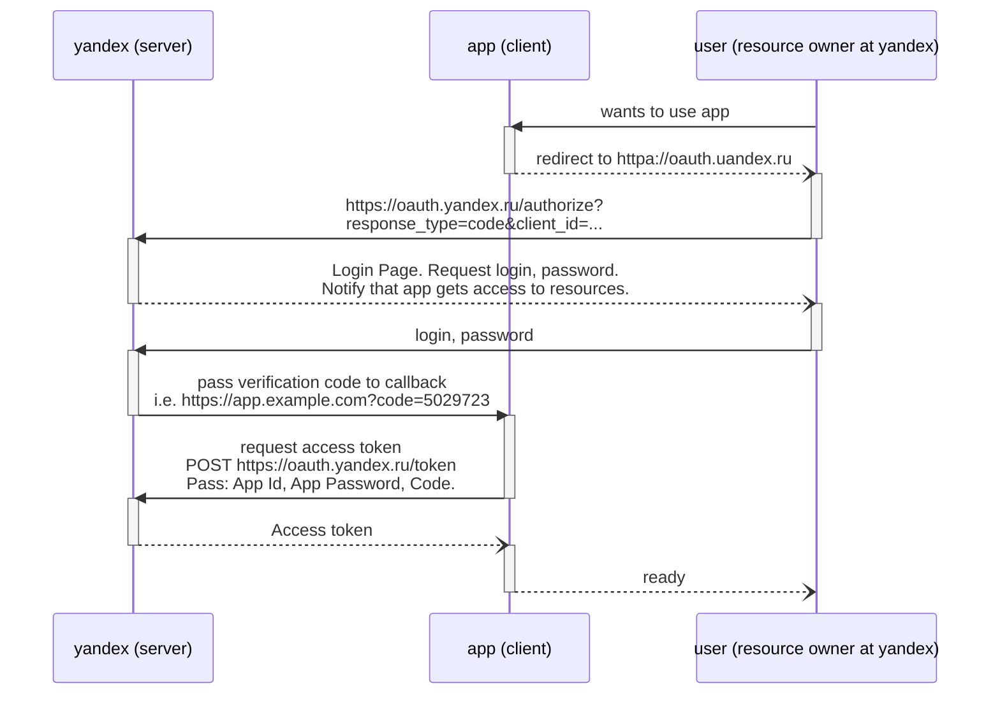

OAuth — открытый протокол (схема) авторизации, который позволяет предоставить третьей стороне ограниченный доступ к защищённым ресурсам пользователя без необходимости передавать ей (третьей стороне) логин и пароль. [источник](https://ru.wikipedia.org/wiki/OAuth)

# oauth.yandex.ru 

https://oauth.yandex.ru/ - Доступ к вашим данным на Яндексе. Здесь можно зарегистрировать приложение, после чего оно сможет запрашивать у пользователя разрешение на доступ к его данным, хранящимся на серверах Яндекса.

## Регистрация приложения

Зарегистрируем приложение для использования данных Яндекс метрики.

- Залогиньтесь на https://yandex.ru/ под пользователем, который имеет доступ к интересующему вам счетчику яндекс метрики (https://metrika.yandex.ru/list).
- Перейдите на https://oauth.yandex.ru/ и нажмите "Зарегистрировать новое приложение"
  - Укажите параметры приложения
    - название
    - отметьте галочкой платформу "Веб-сервисы" и укажите Callback URI. Можно кликнуть "Подставить URL для разработки" (подставится https://oauth.yandex.ru/verification_code). См [отладочный токен](https://yandex.ru/dev/oauth/doc/dg/tasks/get-oauth-token-docpage/)
    - В доступах отметьмтье: Яндекс.Метрика/Получение статистики
  - Нажмите "Создать приложение" и Получите ID приложения и пароль
- Запросите для приложения доступ к данным пользователя и получите токен:
  - Согласно [документации](https://yandex.ru/dev/oauth/doc/dg/tasks/get-oauth-token-docpage/) перейтите по ссылке вида https://oauth.yandex.ru/authorize?response_type=token&client_id=<идентификатор приложения>. Т.о. приложение запросит доступ к вашим данным на Яндексе. 
  - Нажмите "Разрешить". Будет вызван указанный вами `Callback URI`. Тестовый Callback URI (https://oauth.yandex.ru/verification_code) просто показывает вам токен.

## Получение токена доступа

### Для отладочных целей

Перейдите по https://oauth.yandex.ru/authorize?response_type=token&client_id=<идентификатор приложения>. Будет вызван `Callback URI` в виде https://oauth.yandex.ru/verification_code#access_token=AaAAAAAA1zzzzzzzzzzzzzzzxxxxxxxxxxxxxxx&token_type=bearer&expires_in=31535167

### С использованием одноразового кода

Перейдите по https://oauth.yandex.ru/authorize?response_type=code&client_id=<идентификатор приложения>. Будет вызван `Callback URI` с параметром `code` (например https://oauth.yandex.ru/verification_code?code=1234567). Далее ваше приложение, используя полученный код, а также свой ID и пароль (полученные при регистрации приложения), может получить токен. Для этого выполните http-запрос вида: 

```
POST https://oauth.yandex.ru/token
Content-Type: application/x-www-form-urlencoded

grant_type=authorization_code
&code=1234567
&client_id=zazazazazazazazazazazazazazazaza
&client_secret=azazazazazazazazazazazazazazazaz
```

Будет получен ответ:

```json
{
  "token_type": "bearer",
  "access_token": "AaAAAAAA1zzzzzzzzzzzzzzzxxxxxxxxxxxxxxx",
  "expires_in": 12345678,
  "refresh_token": "zzz"
}
```

[Sequence Diagram](https://mermaid-js.github.io/mermaid-live-editor/#/view/eyJjb2RlIjoic2VxdWVuY2VEaWFncmFtXG5wYXJ0aWNpcGFudCBzZXJ2ZXIgYXMgeWFuZGV4IChzZXJ2ZXIpXG5wYXJ0aWNpcGFudCBjbGllbnQgYXMgYXBwIChjbGllbnQpXG5wYXJ0aWNpcGFudCB1c2VyIGFzIHVzZXIgKHJlc291cmNlIG93bmVyIGF0IHlhbmRleClcblxudXNlciAtPj4gY2xpZW50IDogd2FudHMgdG8gdXNlIGFwcFxuYWN0aXZhdGUgY2xpZW50XG5jbGllbnQgLS0pLSB1c2VyIDogcmVkaXJlY3QgdG8gaHR0cGE6Ly9vYXV0aC51YW5kZXgucnVcbmFjdGl2YXRlIHVzZXJcbnVzZXIgLT4-LSBzZXJ2ZXIgOiBodHRwczovL29hdXRoLnlhbmRleC5ydS9hdXRob3JpemU_IDxici8-IHJlc3BvbnNlX3R5cGU9Y29kZSZjbGllbnRfaWQ9Li4uXG5hY3RpdmF0ZSBzZXJ2ZXJcbnNlcnZlciAtLSktIHVzZXIgOiBMb2dpbiBQYWdlLiBSZXF1ZXN0IGxvZ2luLCBwYXNzd29yZC4gPGJyLz4gTm90aWZ5IHRoYXQgYXBwIGdldHMgYWNjZXNzIHRvIHJlc291cmNlcy5cbmFjdGl2YXRlIHVzZXJcbnVzZXIgLT4-LSBzZXJ2ZXIgOiBsb2dpbiwgcGFzc3dvcmRcbmFjdGl2YXRlIHNlcnZlclxuc2VydmVyIC0-Pi0gY2xpZW50IDogcGFzcyB2ZXJpZmljYXRpb24gY29kZSB0byBjYWxsYmFjayA8YnIvPiBpLmUuIGh0dHBzOi8vYXBwLmV4YW1wbGUuY29tP2NvZGU9NTAyOTcyM1xuYWN0aXZhdGUgY2xpZW50XG5jbGllbnQgLT4-LSBzZXJ2ZXIgOiByZXF1ZXN0IGFjY2VzcyB0b2tlbiA8YnIvPiBQT1NUIGh0dHBzOi8vb2F1dGgueWFuZGV4LnJ1L3Rva2VuIDxici8-IFBhc3M6IEFwcCBJZCwgQXBwIFBhc3N3b3JkLCBDb2RlLlxuYWN0aXZhdGUgc2VydmVyXG5zZXJ2ZXIgLS0pLSBjbGllbnQgOiBBY2Nlc3MgdG9rZW5cbmFjdGl2YXRlIGNsaWVudFxuY2xpZW50IC0tKS0gdXNlciA6IHJlYWR5IiwibWVybWFpZCI6eyJ0aGVtZSI6ImRlZmF1bHQiLCJzZXF1ZW5jZSI6eyJzaG93U2VxdWVuY2VOdW1iZXJzIjp0cnVlfX0sInVwZGF0ZUVkaXRvciI6ZmFsc2V9)

<!--

-->

## Использование токена для доступа к данным

```
https://api-metrika.yandex.net/management/v1/counter/11111111/logrequests
Authorization: OAuth AaAAAAAA1zzzzzzzzzzzzzzzxxxxxxxxxxxxxxx
Accept-Encoding: gzip
```

## Полезные утилиты: modheader и JsonDiscovery

Может быть удобным использование расширений chrome:
- https://bewisse.com/modheader/help/ - Chrome extension to modify headers.
- https://github.com/discoveryjs/browser-extension-json-discovery

Т.к. ответы от API яндекс метрики приходят в формате json, то для просмотра результата удобно использовать JsonDiscovery, modheader в данном случае будет подставлять заголовок с токеном: `Authorization: OAuth AaAAAAAA1zzzzzzzzzzzzzzzxxxxxxxxxxxxxxx`.